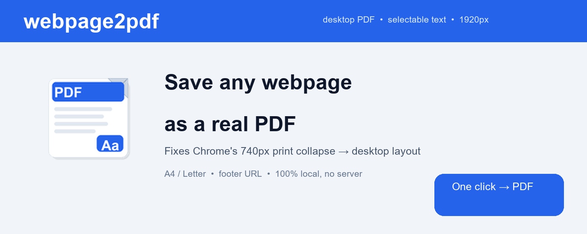
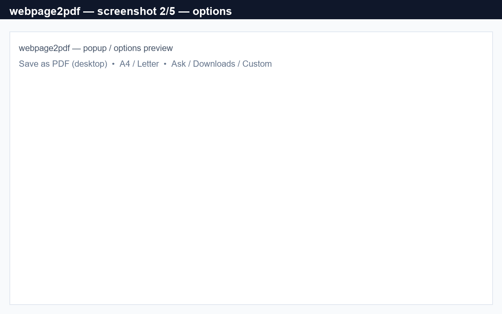
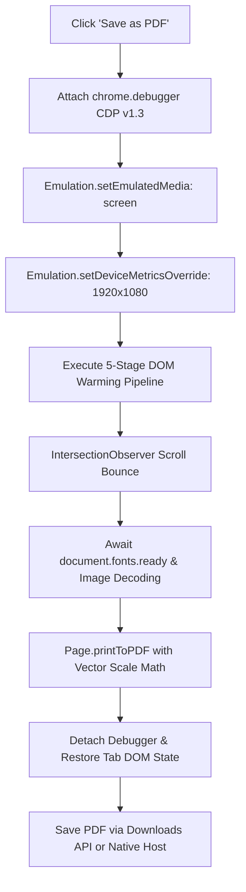

<p align="center">
  
</p>

<h1 align="center">webpage2pdf</h1>

<p align="center">
  <strong>Save any webpage as a real desktop PDF with selectable text — exactly as you see it on a 1920px screen.</strong><br>
  No 740px mobile layout collapse. No blurry raster screenshots. 100% local, private, and powered by the Chrome DevTools Protocol.
</p>

<p align="center">
  <a href="https://chromewebstore.google.com/detail/webpage2pdf/cegjlapelggifcbenhbbannadlajccbn">
    
  </a>
  
  
  
  <a href="LICENSE">
    
  </a>
  
  <a href="https://github.com/igorsaevets/webpage2pdf/issues">
    
  </a>
</p>

---

## 📌 Product Overview: The Problem, The Pain & The Solution

### 1. The Core Problem (Why Chrome's Native "Print to PDF" is Broken)
For over 15 years, Chromium's built-in **Print to PDF** (`Ctrl+P` / `Cmd+P`) has suffered from a fundamental architectural flaw:
When calculating the layout viewport for printing, Chrome sets the CSS viewport width equal to the physical paper width minus printable margins:
* **ISO A4 (8.27" - 0.8" margins):** $7.47" \times 96\text{ DPI} = \mathbf{717.12\text{ px}}$
* **US Letter (8.5" - 0.8" margins):** $7.7" \times 96\text{ DPI} = \mathbf{739.2\text{ px}}$

Every modern web framework (Tailwind CSS, Bootstrap, Flexbox/CSS Grid, Elementor, WordPress, Material UI) defines responsive breakpoints at **`768px` (`md`)**, **`1024px` (`lg`)**, and **`1280px` (`xl`)**.

Because **$717\text{ px} - 739\text{ px} < 768\text{ px}$**, Chrome's print engine triggers `@media (max-width: 767px)`. **Your desktop browser is forced into a budget smartphone layout before printing.** On top of that, aggressive `@media print` style sheets strip background graphics, delete navigation bars, and distort charts.

---

### 2. The User Pain (Why Existing Alternatives Fail)

| Pain Category | What Happens with Other Tools | The Cost to You |
| :--- | :--- | :--- |
| **💥 Broken Layout Collapse** | Native `Ctrl+P` collapses 3-column grids, dashboards, and sidebars into a single vertical column. | A clean 2-page report inflates into a 25-page disjointed mess of stacked widgets. |
| **🖼️ The "Screenshot Trap"** | Extensions like *GoFullPage* or *FireShot* take PNG screenshots and stitch them into a PDF. | **Zero selectable text.** You cannot copy quotes, numbers, or code. **`Ctrl+F` search is dead.** Unusable with screen readers. Giant **20MB+ files** that pixelate when zoomed. |
| **🔒 The Cloud Privacy Trap** | Cloud PDF converters (e.g. *PDFShift*, *DocRaptor*, *CloudConvert*) require sending your URL or HTML to their servers. | **Severe privacy hazard.** Leaks confidential financial dashboards, internal wikis, or personal emails to 3rd-party servers. **Fails on authenticated sessions, paywalls, and internal intranets.** |
| **👻 Missing Lazy Images** | Modern web apps defer off-screen images (`loading="lazy"`, `IntersectionObserver`, `data-src`). | Half of the article diagrams, charts, and product images print as blank white rectangles. Inactive slider/carousel images are completely omitted. |
| **🌐 Lost Translations & SPAs** | Tab-cloning tools open a secondary background tab and re-fetch the raw URL. | Wipes out live Google Translate / DeepL translations, dynamic SPA filters, expanded accordions, and active session state. |

---

### 3. The Solution: `webpage2pdf`
`webpage2pdf` re-engineers browser PDF generation from the ground up:
* 🖥️ **Virtual 1920px Full HD Desktop Viewport:** Uses Chrome DevTools Protocol (`chrome.debugger`) to force desktop media evaluation (`Emulation.setDeviceMetricsOverride` + `media: screen`).
* 📐 **Accurate Vector Downscaling:** Mathematically scales the 1920px canvas to fit A4 ($0.3735$) or US Letter ($0.385$) paper directly inside Chromium's native Skia PDF engine.
* 🔤 **True Vector Text Layer:** Every single character remains genuine selectable, searchable, copyable, and accessible vector text. Hyperlinks stay clickable. File size stays compact (typically **200 KB – 1.5 MB**).
* ⚡ **5-Stage Automated DOM Pre-Warming:** Automatically converts lazy images (`loading="lazy"` → `loading="eager"`, `data-src` → `src`), pre-caches CSS `background-image` assets across thousands of nodes, expands hidden carousel slides, and executes a staged scroll-bounce to satisfy `IntersectionObserver` before printing.
* 🔄 **Live-Tab Preservation:** Prints the live active tab in place. Authenticated dashboards, internal corporate intranets, paywalled articles, and translated pages (Google Translate / DeepL) are captured verbatim.
* 🛡️ **100% Local & Zero Telemetry:** No cloud servers, no data collection, no background tracking. Completely private and open source.

---

## 📸 Visual Showcase

<table align="center">
  <tr>
    <td align="center" width="50%">
      <strong>Popup Interface</strong><br>
      <em>One-click desktop PDF capture with instant paper & mode feedback.</em><br><br>
      
    </td>
    <td align="center" width="50%">
      <strong>Options & Save Preferences</strong><br>
      <em>Custom paper formats (A4/Letter), margins, and 3 flexible save workflows.</em><br><br>
      
    </td>
  </tr>
</table>

---

## ⚖️ Feature Comparison Matrix

| Capability | `webpage2pdf` | Chrome Print (`Ctrl+P`) | Screenshot Tools (*GoFullPage*) | *SingleFile* | Cloud Converters |
| :--- | :---: | :---: | :---: | :---: | :---: |
| **Desktop Layout (1920px)** | ✅ **Yes** | ❌ Collapses (~740px) | ✅ Yes | ✅ Yes | ⚠️ Depends |
| **Selectable / Searchable Text** | ✅ **True Vector** | ✅ True Vector | ❌ Raster (0% Text) | ✅ (HTML DOM) | ✅ Vector |
| **Compact File Size** | ✅ **200 KB – 1.5 MB** | ✅ ~500 KB | ❌ 15 MB – 50 MB | ✅ 1 MB – 5 MB | ⚠️ 2 MB – 10 MB |
| **Universal PDF Format** | ✅ **Standard PDF** | ✅ Standard PDF | ✅ Wrapped PDF | ❌ HTML file only | ✅ Standard PDF |
| **Lazy-Loaded Images Captured** | ✅ **Automated Pre-warm** | ❌ Missing/Blank | ⚠️ Partial | ✅ Yes | ❌ Frequently fails |
| **Hidden Sliders / Carousels** | ✅ **Expanded & Captured** | ❌ Ignored | ❌ Ignored | ⚠️ Script-dependent | ❌ Ignored |
| **Captures Translated Pages** | ✅ **Yes (Live Tab)** | ⚠️ Often resets | ❌ Resets on reload | ⚠️ Varies | ❌ Fails (Server side) |
| **Captures Behind Logins/Paywalls** | ✅ **Yes (Live Tab)** | ✅ Yes | ✅ Yes | ✅ Yes | ❌ Fails (No cookies) |
| **Clean Page URL in Footer** | ✅ **Auto 2-line wrap** | ⚠️ Messy URL cut | ❌ No footer | ❌ No footer | ⚠️ Custom code |
| **100% Offline / Zero Telemetry** | ✅ **100% Local** | ✅ Local | ⚠️ Some have tracking | ✅ Local | ❌ 0% (Cloud leak) |

---

## 🧠 Under The Hood: Technical Architecture & Mathematics



### 1. The Scaling Formula
To fit a full **1920px** desktop viewport onto standard paper without clipping or horizontal scrollbars, `webpage2pdf` calculates the exact vector scale:

$$\text{Scale Factor} = \frac{(W_{\text{paper}} - 2 \cdot M) \times 96}{1920}$$

Where:
* $W_{\text{paper}}$ = Paper width in inches ($8.27"$ for A4, $8.5"$ for US Letter)
* $M$ = Left and right margins ($0.4"$ each)
* $96$ = Standard CSS reference pixels per inch

$$\text{Scale}_{\text{A4}} = \frac{(8.27 - 0.8) \times 96}{1920} = \frac{7.47 \times 96}{1920} = \mathbf{0.3735}$$

$$\text{Scale}_{\text{Letter}} = \frac{(8.5 - 0.8) \times 96}{1920} = \frac{7.7 \times 96}{1920} = \mathbf{0.3850}$$

### 2. The 5-Stage Pre-Print DOM Warming Pipeline
Before taking the snapshot, `webpage2pdf` runs an automated pre-flight script directly inside the page:
1. **Lazy Image Normalization:** Converts `loading="lazy"` to `loading="eager"`, forces `decoding="sync"`, and swaps `data-src`, `data-lazy-src`, `data-original` into `src`. Unwraps `<noscript>` image fallbacks.
2. **CSS Background Image Pre-Caching:** Scans up to 5,000 DOM elements, extracts computed `background-image: url(...)` styles, and instantiates off-screen `Image()` objects to ensure all background textures and banners are decoded in browser cache.
3. **Slider & Carousel Expansion:** Detects popular slider frameworks (Swiper, Slick, Owl, Flickity, Splide, Bootstrap Carousel) and `<details>` elements, temporarily forcing non-active slides into visibility so image resources fetch, then seamlessly restores the original state.
4. **Staged Scroll Bounce:** Programmatically scrolls through 10 viewport increments to trigger any `IntersectionObserver` listeners across the entire document height, bounces to the footer, and returns to top.
5. **Font Readiness & Image Poll:** Awaits `document.fonts.ready` and continuously polls pending image loads against an 8-second safety deadline before triggering `Page.printToPDF`.

---

## 🚀 Installation

### Method 1: Chrome Web Store (Recommended)
> *Status: Currently in **Pending Review** by Google.*
* [Install from Chrome Web Store](https://chromewebstore.google.com/detail/webpage2pdf/cegjlapelggifcbenhbbannadlajccbn)

### Method 2: Manual Installation (Developer Mode / Releases)
1. Download the latest `webpage2pdf-v0.4.1.zip` from [Releases](https://github.com/igorsaevets/webpage2pdf/releases).
2. Unpack the `.zip` folder.
3. In Chrome, navigate to `chrome://extensions`.
4. Toggle **"Developer mode"** in the top right corner.
5. Click **"Load unpacked"** and select the unzipped directory (`.output/chrome-mv3`).

### Method 3: Build From Source
```bash
# Clone repository
git clone https://github.com/igorsaevets/webpage2pdf.git
cd webpage2pdf

# Install dependencies
npm install

# Compile TypeScript & bundle with WXT
npm run build

# Or launch live development reload
npm run dev
```
The compiled extension will be in `.output/chrome-mv3`.

---

## ⚙️ Configuration & Save Modes

Open the extension **Options** (right click extension icon → *Options*) to configure your workflow:

### 1. Paper Format & Margins
* **A4** ($210 \times 297\text{ mm}$ / $8.27 \times 11.69"$) — Standard worldwide.
* **US Letter** ($8.5 \times 11"$) — Standard in North America.
* Margins: $0.4"$ (top, left, right), $0.6"$ (bottom footer).

### 2. Three Flexible Save Modes
1. **Mode 1: Ask where to save each time (Default)**
   * Triggers the native system file dialog. Perfect for filing documents into specific client or project folders.
2. **Mode 2: Auto-save to Downloads (One-click flow)**
   * Silently saves the PDF to your default browser `Downloads/` directory, with an optional customizable subfolder (e.g. `Downloads/WebPDFs/`).
3. **Mode 3: Custom absolute path via Native Host (Power User)**
   * Uses Chrome's `nativeMessaging` to communicate with an optional lightweight local Python companion script (`native-host/host.py`).
   * Bypasses the Chrome browser sandbox and saves directly to any absolute path (e.g., `D:\Research\Archive\` or a local network drive).

### 3. Clean Filename Format
Files are automatically named using sanitized domain, path, and ISO date:
`{hostname}-{slug}-{YYYY-MM-DD}.pdf` (e.g., `github.com-igorsaevets-webpage2pdf-2026-09-09.pdf`).

---

## 🕵️ Power-User & Unconventional Use Cases

* 📰 **Paywall & Subscription Archiving:** If you subscribe to paid publications (Financial Times, Bloomberg, Substack, academic journals), cloud archivers cannot bypass login screens. Because `webpage2pdf` prints your *active tab session*, you can save pristine personal research archives of articles you legitimately have access to.
* 🏢 **Air-Gapped & Corporate Intranets:** Internal Grafana dashboards, Jira tickets, AWS consoles, and private Notion/Confluence workspaces cannot be processed by cloud APIs without leaking security tokens. `webpage2pdf` runs 100% inside your local machine with zero external network calls.
* 🌍 **Multilingual Research with Live Translation:** When translating foreign documentation or articles using Google Translate or DeepL in Chrome, `webpage2pdf` captures the translated DOM in-place without reverting to the original language.
* 📊 **Dynamic Single Page Applications (SPAs):** Capture interactive data tables with applied filters, expanded tree-nodes, or tabs without re-triggering a page reload.

---

## 🔒 Security, Privacy & Permissions Transparency

`webpage2pdf` adheres to strict security standards. **No user data, URLs, or document contents ever leave your device.**

| Permission | Why It Is Strictly Required |
| :--- | :--- |
| **`debugger`** | Required to invoke Chrome DevTools Protocol commands (`Emulation.setDeviceMetricsOverride` and `Page.printToPDF`). **No other WebExtension API in Chromium is capable of rendering a 1920px desktop layout or generating vector PDFs with background graphics.** A small browser banner displays briefly during capture. |
| **`activeTab`** | Ensures the extension only receives access to the active page when you explicitly click the extension button. |
| **`downloads`** | Required to save the generated PDF file to your local computer via `chrome.downloads.download`. |
| **`storage`** | Stores user preferences (paper format, chosen save mode, subfolder name) locally via `chrome.storage.sync`. |
| **`scripting`** | Required to run the DOM pre-warming helpers (lazy images and CSS background-image caches) before capturing. |
| **`nativeMessaging`** | *(Optional)* Used exclusively if you choose Save Mode 3 to send the PDF bytes to the optional local Python host. |

---

## ❓ FAQ (Frequently Asked Questions)

#### Q: Why does Chrome display a banner saying `"webpage2pdf started debugging this browser"`?
**A:** This is a built-in Chromium security notice whenever `chrome.debugger` is attached. `webpage2pdf` attaches to the tab for approximately 1–2 seconds solely to override the viewport to 1920px, generate the vector PDF via `Page.printToPDF`, and immediately detaches. It does not monitor keystrokes or inject remote scripts.

#### Q: How is the text selectable if the page is scaled down to 37%?
**A:** Unlike canvas tools that scale pixels, Chromium's Skia graphics engine creates true mathematical vector paths and embeds vector font glyphs. Whether printed at 100% or 37%, text characters retain their Unicode mapping, searchability, and sharpness at any zoom level in Acrobat, Preview, or Chrome.

#### Q: How does this differ from SingleFile?
**A:** [SingleFile](https://github.com/gildas-lormeau/SingleFile) is a phenomenal tool that packages pages into a single self-contained `.html` file. However, HTML files are not universally accepted in legal discovery, formal printouts, PDF annotation apps (GoodNotes, Notability), e-readers (Kindle/reMarkable), or enterprise document management systems. `webpage2pdf` produces standardized, vector-rendered `.pdf` files.

---

## 🤝 Contributing

Contributions, bug reports, and suggestions are warmly welcomed!
1. Fork the repository.
2. Create your feature branch (`git checkout -b feature/amazing-feature`).
3. Commit your changes (`git commit -m 'Add amazing feature'`).
4. Push to the branch (`git push origin feature/amazing-feature`).
5. Open a Pull Request.

---

## 📄 License

This project is licensed under the [MIT License](LICENSE) — Copyright (c) 2026 Igor Saevets.
